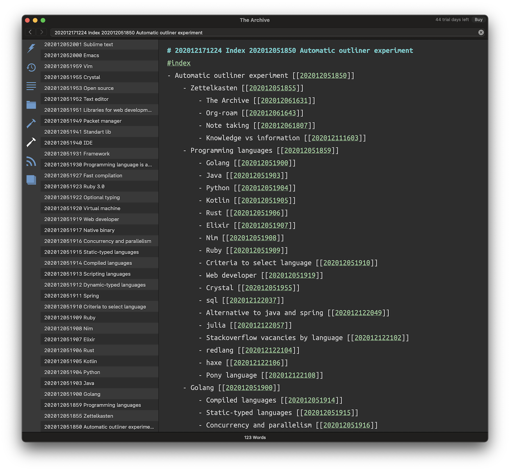

# r-notes

This is a collection of tools I use for my notes in markdown, zettelkasten alike, format.

---

## Regenerate-backlinks

Recalculates backlinks for notes, and appends to the end of files.

### Install

`go install github.com/romanthekat/r-notes/cmd/regenerate-backlinks@latest`

### Usage

`regenerate-backlinks "path/to/notes/folder"`

---

## Outliner

Generates an outline for a note with links.   
Relies on `[[wiki-link]]` format to find related notes.

For example with 3 levels depth (note -> links -> links of links)(The Archive app):

### Install

`go install github.com/romanthekat/r-notes/cmd/outliner@latest`

### Build manually

`go build ./cmd/outliner/`  
`go install ./cmd/outliner/`  
`go run ./cmd/outliner/`

`go test ./cmd/outliner/`

### Usage

`outliner "path/to/note.md"`  
will generate `/path/to/DATE_ZK_ID.md`