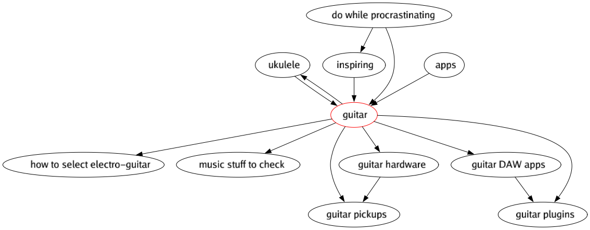

# r-notes

This is a collection of tools I use for my notes in markdown, zettelkasten alike, format.  
A tool relies on `[[wiki-link]]` format to find related notes, and time-based id in format `202012051855`.  
Both `[[202012121859]]` and `[[202012121859 note taking apps]]` wikilinks format supported, though the latter is used for auto-generated files as being more exact and widely supported by different apps. 

Always do backups :)

## CLI tools
### Build a tool manually
`go build ./cmd/CMD/`  
`go install ./cmd/CMD/`  
`go run ./cmd/CMD/`


### 1. Regenerate-backlinks
Recalculates backlinks for notes, updates files appending the result to the end of a file.   
For example:
```
...note as is...
## Backlinks
- [[202012051859 programming languages]]
- [[202012141632 always be coding]]
- [[202106071713 keeping context]]
- [[202111241342 index for 'criteria to select language']]
- [[202201161342 Jevons paradox]]
- [[202201161344 Hyrum Law]]
- [[202201242307 Chesterton Fence]]
- [[202201251438 The Joel Test]]
```
Please note, everything after `## Backlinks` is considered a backlinks block and **will be replaced**.

Usage:  
`regenerate-backlinks "path/to/notes/folder"`

Install:  
`go install github.com/romanthekat/r-notes/cmd/regenerate-backlinks@latest`


### 2. Sub-graph
Renders subgraph by provided note file.

Usage:  
`sub-graph -notePath="path/to/note.md" -outputPath="path/to/graph.png"`  
`sub-graph -h`
```
Usage of ./sub-graph:
  -depth int
        graph depth to render (default 2)
  -ignoreTags string
    	comma seperated list of tags which is used to ignore/filter notes
  -notePath string
        a path to note file
  -outputPath string
        a path to rendered graph file (default "./")
```

Example:  
`sub-graph -notePath="path/to/notes/202111271135 guitar.md" -outputPath="/tmp/sub-graph-example.png" -depth=1`


Install:  
`go install github.com/romanthekat/r-notes/cmd/sub-graph@latest`


### 3. Full-graph
Renders graph of all notes within provided folder.  
Please note, 700+ notes' graph will be somewhat big.

Usage:  
`full-graph "path/to/notes/folder"`

Install:  
`go install github.com/romanthekat/r-notes/cmd/full-graph@latest`


### 4. Unlinked
Prints list of notes without (back)links.  

Usage:  
`unlinked "path/to/notes/folder"`

Install:  
`go install github.com/romanthekat/r-notes/cmd/unlinked@latest`


### 5. Tags cloud
Prints list of tags ordered by popularity.

Usage:  
`tags-cloud "path/to/notes/folder"`

Install:  
`go install github.com/romanthekat/r-notes/cmd/tags-cloud@latest`


### 6. Outliner
Generates an outline note for a note.  
For example with 3 levels depth (note -> links -> links of links):
```
---
title: index for 'automatic outliner experiment'
date: 2022-06-19 14:24
tags: #index
---
# 202206191424 index for 'automatic outliner experiment'
- [[202012051850 automatic outliner experiment]]  
    - [[202012051855 zettelkasten]]  
        - [[202012051959 vim]]  
        - [[202012061631 the archive]]  
        - [[202012061643 org-roam]]  
        - [[202012061807 Σ note taking]]  
        - [[202012092253 note types]]  
        - [[202012111603 knowledge vs information]]  
        - [[202012121859 note taking apps]]  
        - [[202012122000 wiki]]  
        - [[202105252045 my zk app aka r-notes]]  
        - [[202205092304 zettelkasten.de]]  
    - [[202012051859 programming languages]]  
        - [[202012051910 Σ criteria to select language]]  
        - [[202012122102 stackoverflow vacancies by language]]  
        - [[202104232303 create my own programming language]]  
    - [[202012051900 golang]]  
        - [[202012051859 programming languages]]  
        - [[202012051914 compiled languages]]  
        - [[202012051915 static-typed languages]]  
        - [[202012051916 concurrency and parallelism]]  
        - [[202012051917 native binary]]  
        - [[202012051919 web developer]]  
        - [[202012051927 fast compilation]]  
        - [[202012061755 golang manual]]  
        - [[202012061759 miss in golang]]  
        - [[202012122011 Σ programming]]  
        - [[202012122116 frameworks ratings for golang]]  
    - [[202012052002 org-mode]]  
        - [[202012052000 emacs]]  
    - [[202012061624 auto outliner results]]  
        - [[202012061631 the archive]]  
    - [[202012191202 235 read articles and automatic outliner]]  
```

Usage:  
`outliner "path/to/note.md"`  
will generate `/path/to/DATE_ZK_ID index for 'note title'.md`

Install:  
`go install github.com/romanthekat/r-notes/cmd/outliner@latest`
